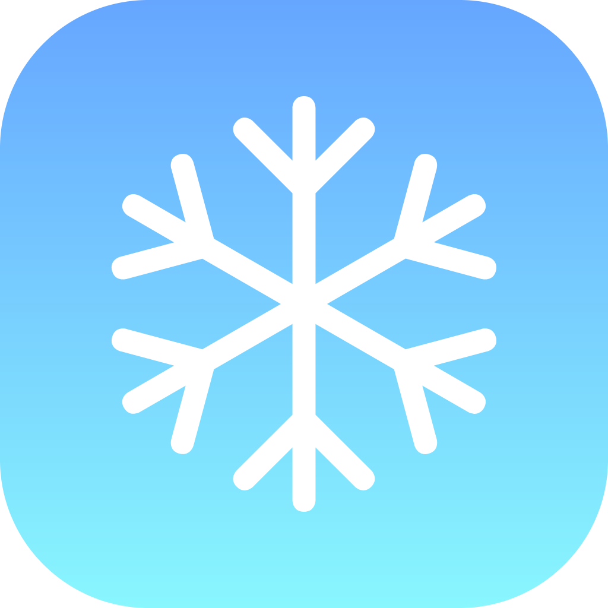

# PolarStart - 极简浏览器起始页

<div align="center">



一个功能丰富、设计精美的现代化浏览器起始页

[](https://opensource.org/licenses/MIT)
[](https://vuejs.org/)
[](https://www.typescriptlang.org/)
[](https://vitejs.dev/)

[English](README.md) | 简体中文

</div>

## ✨ 特性

### 🎨 视觉体验

- **必应每日壁纸** - 每天自动更新的精美壁纸背景
- **现代化设计** - 采用 Tailwind CSS 4.x，流畅的动画效果
- **响应式布局** - 完美适配桌面端、平板和移动设备
- **深色主题** - 保护视力的暗色界面设计

### 🔍 核心功能

- **智能搜索栏** - 集成必应搜索引擎，快速便捷
- **实时时间显示** - 大字体时钟，一目了然
- **底部 Dock 栏** - macOS 风格的快捷访问栏

### 📦 信息小组件

- **🌤️ 实时天气** - 支持定位和城市搜索，多种逆地理编码服务
- **📅 万年历** - 农历、节日、节气完整显示
- **🔥 微博热搜** - 实时追踪热门话题
- **🎵 抖音热搜** - 了解最新流行趋势
- **🐟 摸鱼日报** - 每日一图，轻松愉快
- **📖 答案之书** - 随机获取人生建议

### 🗂️ 网站分类库

内置 8 大分类，60+ 精选网站：

- 💻 **开发工具** - GitHub, GitLab, Stack Overflow, npm 等
- 🎨 **设计资源** - Figma, Dribbble, Unsplash, Iconfont 等
- 📚 **学习资源** - MDN, Coursera, LeetCode, 掘金 等
- ⚡ **效率工具** - Notion, Trello, Slack, 飞书 等
- 🤖 **AI 工具** - ChatGPT, Claude, Copilot, 文心一言 等
- 💬 **社交媒体** - Twitter, LinkedIn, 微博, 知乎 等
- 🎬 **娱乐影音** - YouTube, Netflix, B 站, 网易云音乐 等
- 🛍️ **购物平台** - Amazon, 淘宝, 京东, 拼多多 等

## 🚀 快速开始

### 环境要求

- Node.js: `^20.19.0` 或 `>=22.12.0`
- npm 或 yarn 或 pnpm

### 安装

```bash
# 克隆项目
git clone https://github.com/yourusername/polarstart.git

# 进入项目目录
cd polarstart

# 安装依赖
npm install
```

### 开发

```bash
# 启动开发服务器
npm run dev

# 浏览器访问 http://localhost:5173
```

### 构建

```bash
# 类型检查
npm run type-check

# 构建生产版本
npm run build

# 预览生产构建
npm run preview
```

## 🛠️ 技术栈

### 核心框架

- **Vue 3.5** - 渐进式 JavaScript 框架
- **TypeScript 5.8** - 类型安全的 JavaScript 超集
- **Vite 7.0** - 下一代前端构建工具
- **Vue Router 4.6** - 官方路由管理器
- **Pinia 3.0** - 新一代状态管理库

### UI 框架

- **Tailwind CSS 4.x** - 实用优先的 CSS 框架
- **PostCSS** - CSS 转换工具
- **@icon-park/vue-next** - 字节跳动图标库

### 开发工具

- **Vue DevTools** - Vue 开发调试工具
- **vue-tsc** - Vue TypeScript 编译器
- **ESLint & Prettier** - 代码规范和格式化

### 数据持久化

- **pinia-plugin-persistedstate** - Pinia 持久化插件

## 📁 项目结构

```
polarstart/
├── public/                 # 静态资源
│   ├── icons/             # 图标文件
│   └── favicon.ico        # 网站图标
├── src/
│   ├── assets/            # 样式资源
│   │   └── main.css      # 全局样式
│   ├── components/        # 组件目录
│   │   ├── widgets/      # 小组件
│   │   │   ├── WeatherWidget.vue      # 天气组件
│   │   │   ├── CalendarWidget.vue     # 日历组件
│   │   │   ├── WeiboHotWidget.vue     # 微博热搜
│   │   │   ├── DouyinHotWidget.vue    # 抖音热搜
│   │   │   ├── MoyuWidget.vue         # 摸鱼日报
│   │   │   └── AnswerBookWidget.vue   # 答案之书
│   │   ├── CategoryLibrary.vue        # 分类卡片
│   │   ├── DockBar.vue                # Dock 栏
│   │   ├── SearchBar.vue              # 搜索栏
│   │   └── TimeDisplay.vue            # 时间显示
│   ├── data/              # 数据文件
│   │   └── webCategories.ts           # 网站分类数据
│   ├── router/            # 路由配置
│   │   └── index.ts
│   ├── stores/            # 状态管理
│   │   └── settings.ts   # 设置状态
│   ├── views/             # 页面视图
│   │   ├── HomeView.vue              # 主页
│   │   ├── WebCategoriesView.vue     # 网站分类页
│   │   ├── InfoCardsView.vue         # 信息卡片页
│   │   └── AboutView.vue             # 关于页
│   ├── App.vue            # 根组件
│   └── main.ts            # 入口文件
├── .env.example           # 环境变量模板
├── .gitignore            # Git 忽略文件
├── index.html            # HTML 入口
├── package.json          # 项目配置
├── tsconfig.json         # TypeScript 配置
├── vite.config.ts        # Vite 配置
├── postcss.config.js     # PostCSS 配置
└── README.md             # 项目文档
```

## 🎯 使用说明

### 设为浏览器起始页

#### Chrome / Edge

1. 打开浏览器设置
2. 找到"启动时"选项
3. 选择"打开特定网页或一组网页"
4. 添加本项目的访问地址

#### Firefox

1. 打开浏览器设置
2. 找到"主页"选项
3. 在"主页和新窗口"中输入项目地址

#### Safari

1. 打开 Safari 偏好设置
2. 选择"通用"标签
3. 在"主页"中输入项目地址

### 功能导航

- **主页** - 搜索、时间显示和必应壁纸
- **信息卡片** - 点击 Dock 栏"信息"图标，查看各类小组件
- **网站分类** - 点击 Dock 栏"文件夹"图标，浏览网站分类库
- **设置** - 点击右上角设置图标，自定义配置（功能开发中）

## 🚀 部署

### Vercel 部署

[](https://vercel.com/new/clone?repository-url=https://github.com/yourusername/polarstart)

1. Fork 本项目
2. 在 Vercel 中导入项目
3. 配置环境变量（可选）
4. 点击部署

### Netlify 部署

[](https://app.netlify.com/start/deploy?repository=https://github.com/yourusername/polarstart)

1. Fork 本项目
2. 在 Netlify 中导入项目
3. 构建命令：`npm run build`
4. 发布目录：`dist`

### 静态服务器部署

```bash
# 构建项目
npm run build

# dist 目录即为生产文件，可部署到任何静态服务器
```

## 🤝 贡献

欢迎贡献代码、报告问题或提出建议！

1. Fork 本项目
2. 创建特性分支 (`git checkout -b feature/AmazingFeature`)
3. 提交更改 (`git commit -m 'Add some AmazingFeature'`)
4. 推送到分支 (`git push origin feature/AmazingFeature`)
5. 开启 Pull Request

## 📝 开发计划

- [ ] 设置页面完善
- [ ] 自定义网站分类和小组件
- [ ] 主题切换（亮色/暗色模式）
- [ ] 壁纸源选择（必应/自定义）
- [ ] 搜索引擎切换（必应/谷歌/百度等）
- [ ] 快捷键支持
- [ ] 书签同步功能
- [ ] 多语言支持
- [ ] 更多小组件（天气预报、待办事项等）
- [ ] 自定义布局和样式

## 🐛 已知问题

暂无已知问题。如发现问题请提交 [Issue](https://github.com/yourusername/polarstart/issues)。

## 📄 许可证

本项目采用 [MIT](LICENSE.txt) 许可证。

## 🙏 致谢

- [Vue.js](https://vuejs.org/) - 渐进式 JavaScript 框架
- [Vite](https://vitejs.dev/) - 下一代前端构建工具
- [Tailwind CSS](https://tailwindcss.com/) - 实用优先的 CSS 框架
- [必应壁纸](https://www.bing.com/) - 每日精美壁纸
- [IconPark](https://iconpark.oceanengine.com/) - 字节跳动图标库

## 📮 联系方式

如有问题或建议，欢迎通过以下方式联系：

- 提交 [Issue](https://github.com/yourusername/polarstart/issues)
- 发起 [Pull Request](https://github.com/yourusername/polarstart/pulls)

---

<div align="center">

**[⬆ 回到顶部](#polarstart---极简浏览器起始页)**

Made with ❤️ by qgming

</div>
