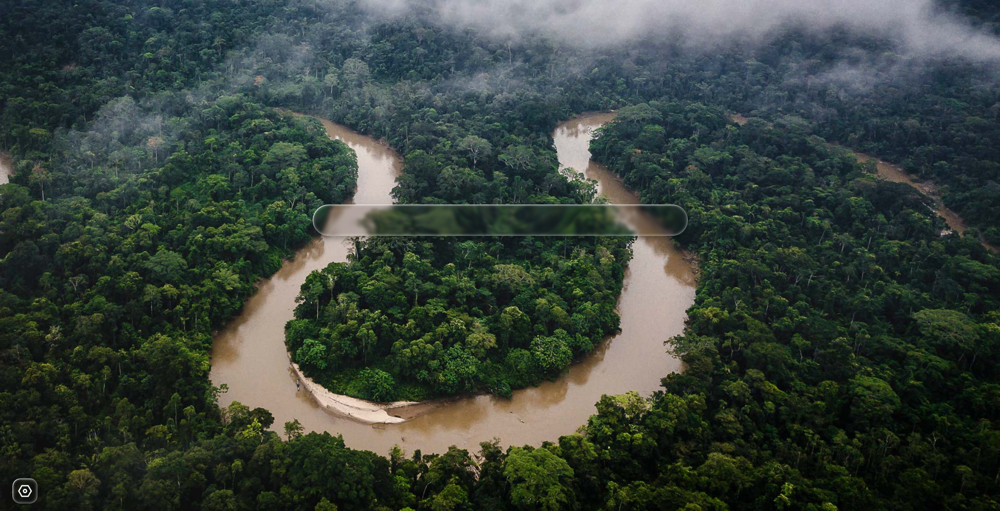

# ❄️ PolarStart - 极点起始页

[](https://github.com/qgming/polarstart)
[](https://vuejs.org/)
[](https://www.typescriptlang.org/)
[](https://vitejs.dev/)
[](./LICENSE.txt)

> 一个现代化、优雅且高度可定制的浏览器起始页，采用苹果液态玻璃设计美学，为您带来极致的视觉体验和流畅的交互感受。

## ✨ 核心特性

### 🪟 液态玻璃设计

- **苹果风格美学** - 采用最新的液态玻璃设计语言
- **毛玻璃效果** - backdrop-filter 实现的真实模糊效果
- **渐变配色** - 优雅的蓝紫色渐变主题
- **流畅动画** - 精心调校的过渡和交互动画

### 🖼️ 智能壁纸系统

- **每日壁纸** - 自动更新微软必应每日精选壁纸
- **随机壁纸** - 从海量必应壁纸库中随机展示
- **自定义壁纸** - 内置 8 张精选壁纸，支持快速切换
- **自适应布局** - 完美适配各种屏幕尺寸和比例

### 🔍 强大搜索功能

- **多引擎支持** - 内置百度、谷歌、必应等主流搜索引擎
- **自定义引擎** - 支持添加任意搜索引擎
- **快捷切换** - 一键切换不同搜索引擎
- **实时搜索** - 支持回车键快速搜索

### ⚙️ 完善的设置系统

- **搜索引擎管理** - 添加、编辑、删除自定义搜索引擎
- **壁纸设置** - 便捷的壁纸选择和切换界面
- **持久化存储** - 所有设置自动保存到本地
- **优雅的 UI** - 统一的液态玻璃风格设置界面

### 📱 响应式体验

- **多设备适配** - 完美支持桌面、平板、手机
- **触控优化** - 针对触摸屏优化的交互体验
- **性能卓越** - 基于 Vue 3 Composition API 和 Vite 构建

## 📸 展示

以下是 PolarStart 的实际运行效果展示：





## 🚀 快速开始

### 环境要求

- Node.js >= 20.19.0 或 >= 22.12.0
- npm 或 pnpm

### 安装运行

```bash
# 克隆项目
git clone https://github.com/qgming/polarstart.git
cd polarstart

# 安装依赖
npm install

# 启动开发服务器
npm run dev

# 构建生产版本
npm run build

# 预览生产构建
npm run preview
```

访问 `http://localhost:5173` 即可查看应用。

## 🛠️ 技术栈

| 技术           | 版本   | 说明                                               |
| -------------- | ------ | -------------------------------------------------- |
| **Vue 3**      | 3.5.18 | 采用 Composition API，提供更好的类型推导和代码组织 |
| **TypeScript** | 5.8.0  | 完整的类型支持，提升开发体验和代码质量             |
| **Vite**       | 7.0.6  | 极速的开发服务器和优化的生产构建                   |
| **Pinia**      | 3.0.3  | Vue 官方推荐的状态管理方案                         |
| **Vue Router** | 4.5.1  | 官方路由管理器                                     |

### 项目特点

- ✅ 完整的 TypeScript 类型定义
- ✅ 组件化开发，代码结构清晰
- ✅ Pinia 状态管理 + 持久化插件
- ✅ 现代 CSS 特性（Grid、Flex、backdrop-filter）
- ✅ 响应式设计，移动端优化

## 📁 项目结构

```
polarstart/
├── src/
│   ├── components/          # 组件目录
│   │   ├── AboutSettings.vue       # 关于页面
│   │   ├── LiquidGlass.vue         # 液态玻璃组件
│   │   ├── SearchEngineSettings.vue # 搜索引擎设置
│   │   ├── SettingsModal.vue       # 设置弹窗
│   │   └── WallpaperSettings.vue   # 壁纸设置
│   ├── stores/              # 状态管理
│   │   └── settings.ts      # 设置状态
│   ├── views/               # 视图页面
│   │   └── HomeView.vue     # 主页
│   ├── App.vue              # 根组件
│   └── main.ts              # 入口文件
├── public/                  # 静态资源
│   ├── icons/               # 图标
│   └── wallpapers/          # 壁纸资源
└── show/                    # 展示图片
```

## 🎨 设计规范

### 液态玻璃效果

```css
background: linear-gradient(
  135deg,
  rgba(255, 255, 255, 0.5) 0%,
  rgba(255, 255, 255, 0.3) 100%
);
backdrop-filter: blur(20px) saturate(180%);
border-radius: 20px;
border: 1px solid rgba(255, 255, 255, 0.3);
```

### 渐变配色

- 主色调：`#3b82f6` (蓝色) → `#8b5cf6` (紫色)
- 背景：半透明白色渐变
- 阴影：多层次 box-shadow

### 间距规范

- 主板块间距：24px
- 标题与内容：12px
- 列表项间距：12px
- 卡片内边距：16-18px

## 🌟 功能亮点

### 1. 智能壁纸切换

- 支持三种壁纸模式（每日/随机/自定义）
- 8 张内置精选壁纸
- 图片预加载，切换流畅

### 2. 搜索引擎管理

- 预设 5 个主流搜索引擎
- 支持添加/编辑/删除自定义引擎
- URL 格式验证

### 3. 设置持久化

- 基于 Pinia + localStorage
- 自动保存所有配置
- 跨会话保持设置

## 📄 开源协议

本项目采用 [MIT](./LICENSE.txt) 协议开源。

## 👥 贡献指南

欢迎提交 Issue 和 Pull Request！

1. Fork 本仓库
2. 创建特性分支 (`git checkout -b feature/AmazingFeature`)
3. 提交更改 (`git commit -m 'Add some AmazingFeature'`)
4. 推送到分支 (`git push origin feature/AmazingFeature`)
5. 提交 Pull Request

## 📧 联系方式

- 项目地址：[https://github.com/qgming/polarstart](https://github.com/qgming/polarstart)
- 问题反馈：[Issues](https://github.com/qgming/polarstart/issues)

## ⭐ Star History

如果这个项目对你有帮助，请给我们一个 ⭐️ 吧！

---

**Made with ❤️ by qgming**
